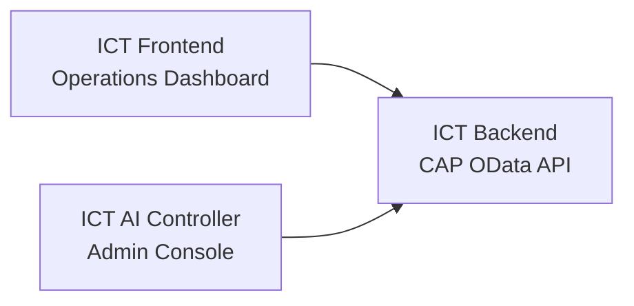
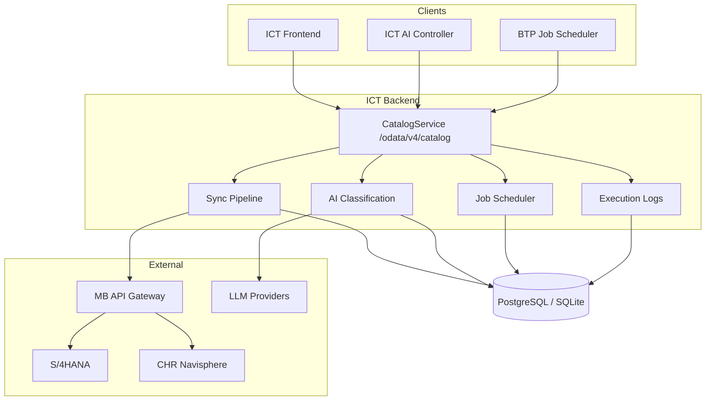
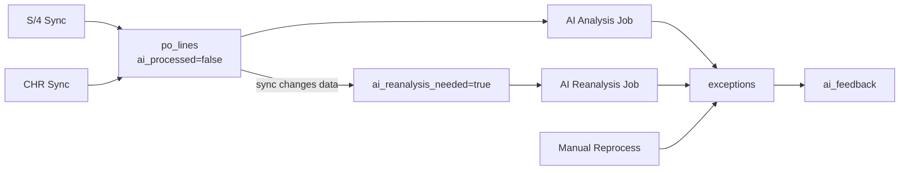
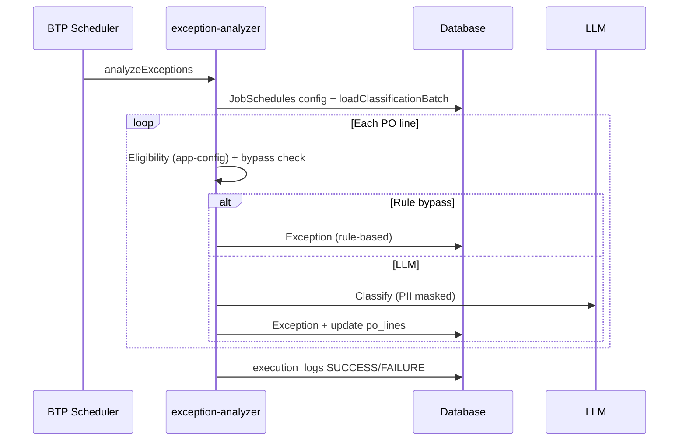
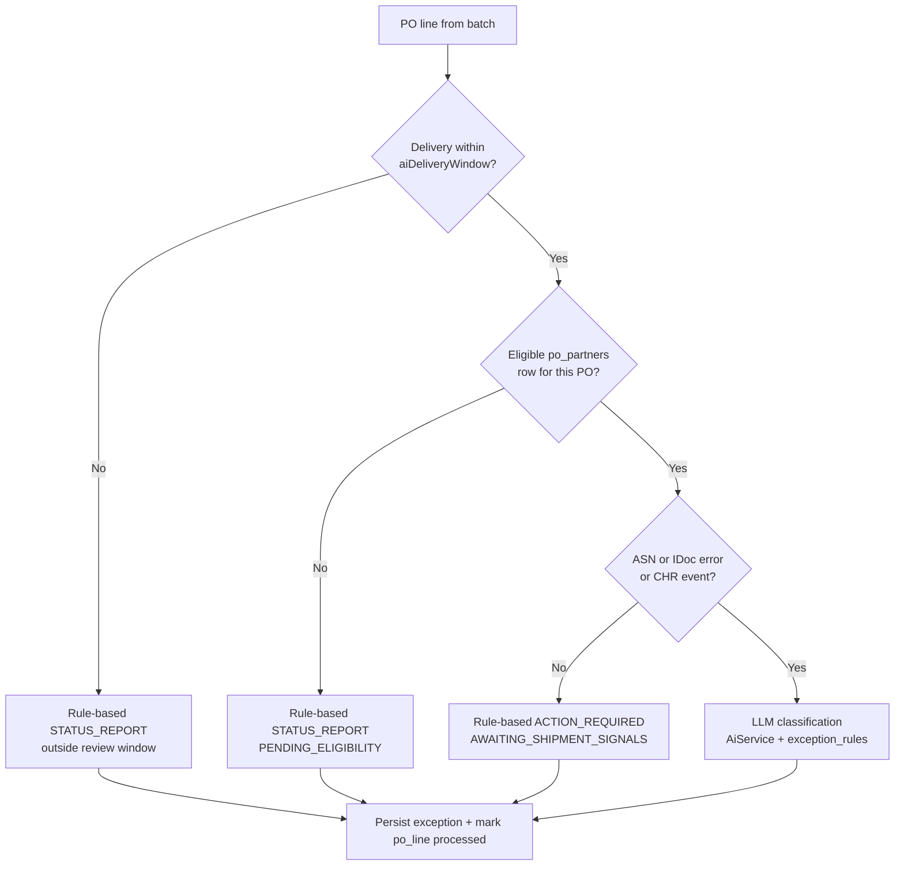

# ICT Backend — Knowledge Transfer Documentation

SAP CAP (Node.js) backend for the **Inbound Control Tower (ICT)**. It syncs supply-chain data from S/4HANA and CHR Navisphere, runs AI-powered exception classification, exposes analytics, and integrates with BTP Job Scheduler.

**OData base URL (local):** `http://localhost:4000/odata/v4/catalog`  
**Swagger UI (dev):** `http://localhost:4000/swagger-ui` · OpenAPI JSON: `/api-docs`

---

## Table of Contents

| # | Section | Read when you need to… |
|---|---------|------------------------|
| 1 | [System Overview](#1-system-overview) | Understand what the backend does and who uses it |
| 2 | [Architecture](#2-architecture) | See how components connect |
| 3 | [Quick Start](#3-quick-start) | Run the project locally |
| 4 | [Data Model](#4-data-model) | Understand tables and AI control fields **before** flows |
| 5 | [End-to-End Lifecycle](#5-end-to-end-lifecycle) | See the full journey: sync → analyse → exception → feedback |
| 6 | [Operational Flows](#6-operational-flows) | Deep-dive each process (summary + code pointers) |
| 6.4.1 | [AI Eligibility & Bypass](#641-ai-eligibility--bypass-logic) | When LLM runs vs rule-only classification |
| 7 | [API Reference](#7-api-reference) | OData entities, functions, actions |
| 8 | [Code Map](#8-code-map) | Find files and handlers |
| 9 | [Security & Auth](#9-security--auth) | XSUAA, encryption, PII |
| 10 | [Deployment (BTP)](#10-deployment-btp) | MTA deploy and service bindings |
| 11 | [Environment Variables](#11-environment-variables) | Config reference |
| 12 | [Development & Testing](#12-development--testing) | Scripts, lint, troubleshooting |
| 13 | [Related Documentation](#13-related-documentation) | Deeper sync/S/4 guides |
| 14 | [KT Session Guide](#14-kt-session-guide) | 90-minute handover agenda |
| 15 | [Coverage Checklist](#15-coverage-checklist) | Verify nothing is missed |

---

## 1. System Overview

### Platform components (three services)

| Display name | Repo folder | Role |
|--------------|-------------|------|
| **ICT Frontend** | `ICT-frontend` | Operations dashboard — PO lines, exceptions, analytics, chat, AI feedback |
| **ICT AI Controller** | `ICT-admin-frontend` | Admin console — LLM config, job schedules, sync triggers, reprocess, execution logs, manage data |
| **ICT Backend** | `ICT-backend` | CAP OData API — sync, AI classification, analytics, BTP job callbacks *(this document)* |



### What it does

| Capability | Summary |
|------------|---------|
| **Data sync** | Pulls master + transactional data from S/4HANA and carrier events from CHR into PostgreSQL (SQLite locally) |
| **AI classification** | Analyses PO lines against exception rules using LLM providers (OpenAI, Gemini, Anthropic) |
| **Job scheduling** | BTP Job Scheduler triggers sync and AI jobs on cron/repeat patterns |
| **Analytics** | Dashboard KPIs, supply-chain metrics, AI usage, and feedback analytics |
| **Manual reprocess** | On-demand re-classification of selected PO numbers (all lines per PO) |
| **Chat assistant** | Conversational agent with safe read access to ICT data |
| **ICT AI Controller ops** | LLM config, job schedules, execution logs, bulk data upload (testing) |

### Who consumes it

| Consumer | Usage |
|----------|-------|
| **ICT Frontend** | PO lines, exceptions, dashboard, chat, AI feedback |
| **ICT AI Controller** | Job schedules, sync triggers, reprocess, LLM config, execution logs, manage data |
| **BTP Job Scheduler** | Callbacks for `analyzeExceptions` and `runScheduledSync` |

### Technology stack

| Layer | Technology |
|-------|------------|
| Framework | SAP CAP 8, OData v4, Express |
| Database | SQLite (dev) / PostgreSQL (prod via `@cap-js/postgres`) |
| Auth | XSUAA (`authenticated-user`); `JobScheduler` scope for scheduled callbacks |
| AI | Vercel AI SDK (`ai`) — OpenAI, Gemini, Anthropic |
| Integrations | S/4 + CHR via `MB_API_GATEWAY` destination; BTP Job Scheduler (`BTP_JOBS`) |

---

## 2. Architecture



### Request path

```
HTTP → XSUAA auth (mocked in dev) → cat-service.cds → handler → lib → ict.* tables
```

### Background job pattern (sync, AI, reprocess)

1. Action returns `{ status: "Accepted", runId }` immediately
2. `cds.spawn` runs work in background
3. `LogCollector` tracks stats in memory
4. `execution-log-persist.js` writes to `ict.execution_logs` (~every 800ms, via `cds.tx()`)
5. Client polls `GET /ExecutionLogs('<runId>')` until status ≠ `RUNNING`

**Why `cds.spawn`?** Cloud Foundry terminates HTTP requests after ~60 seconds. Sync and AI jobs can run for minutes, so handlers **respond immediately** and continue work in a detached background context. The same pattern is used for `syncMasterData`, `analyzeExceptions`, and `reprocessPOs`.

### API error responses

Non-OData errors from Express (`srv/index.js`) return JSON:

```json
{
  "error": {
    "code": "INTERNAL_ERROR",
    "message": "Human-readable message",
    "status": 500
  }
}
```

OData validation errors use the standard CAP OData v4 error format.

### Dev vs production differences

| Aspect | Development | Production |
|--------|-------------|------------|
| Database | SQLite (`db.sqlite`) | PostgreSQL (`APP_PGSQL`) |
| Auth | Mocked user `ict` / `ict` | XSUAA |
| BTP Job Scheduler | **Mock** — jobs stored locally, not sent to BTP | Real BTP Jobs API |
| Sync row cap | 500 rows/entity unless `S4H_SYNC_LIMIT=ALL` | Full sync |
| Swagger UI | Enabled at `/swagger-ui` | Disabled |

---

## 3. Quick Start

### Prerequisites

Node.js **18+**, npm **9+**

### Install & run

```bash
cd ICT-backend
npm install
# Set ENCRYPTION_SECRET in .env (required for LLM config — see §11)
npm run deploy    # create SQLite schema
npm run dev
```

API: `http://localhost:4000/odata/v4/catalog`

### Local bootstrap checklist

Before running AI jobs locally, ensure:

| Step | Action |
|------|--------|
| 1 | Set `ENCRYPTION_SECRET` in `.env` (see §11) |
| 2 | `npm run deploy` — creates schema **and loads seed CSVs** from `db/data/` |
| 3 | Create `LLMConfigs` row with encrypted API key (ICT AI Controller or OData POST) |
| 4 | Ensure `ExceptionRules` exist — **AI job fails if this table is empty** |
| 5 | Sync or upload PO lines, partners, ASN/CHR/IDoc data for realistic classification |

Generate encryption secret:

```bash
node -e "console.log(require('crypto').randomBytes(32).toString('hex'))"
```

### Seed data (`db/data/`)

CAP auto-loads these CSV files on `cds deploy`:

| File | Entity | Content |
|------|--------|---------|
| `ict-config.csv` | `ict.config` | Default `partnerFunction` (`["FS"]`), `partnerSupplier` (`["1000122"]`), `aiDeliveryWindow` (`7` days) |
| `ict-exceptions.csv` | `ict.exceptions` | Header-only template (no sample rows) — structure reference for imports |

**Not seeded:** `exception_rules`, `llm_configs`, PO lines, or master data — load via sync, ICT AI Controller **Manage Data** upload, or OData.

### Scripts

| Command | Purpose |
|---------|---------|
| `npm run dev` | `cds watch` — SQLite, hot reload |
| `npm start` | `cds run` |
| `npm run build` | Build to `gen/` for BTP |
| `npm run deploy` | Deploy schema + seed data to local DB |
| `npm run lint` | ESLint |
| `npm test` | Jest with coverage *(configured in `package.json`; no `test/` suite in repo yet)* |
| `node scripts/sync-po.js` | Manual PO sync utility |
| `node scripts/seed-prep.js` | Prepare seed data |
| `node scripts/clear_records.js` | Clear DB records (dev) |

---

## 4. Data Model

> **Read this before §6.** Flows only make sense once you know the entities and AI flags.

Namespace: `ict` · Schema files: `db/schema/*.cds`

### Entity groups

| Domain | DB entities | OData entity |
|--------|-------------|--------------|
| Master | `plants`, `materials`, `suppliers` | `Plants`, `Materials`, `Suppliers` |
| Transactional | `po_lines`, `po_partners`, `asn_ibd`, `chr_events` | `POLines`, `POPartners`, `ASNIbd`, `CHREvents` |
| Exceptions | `exceptions`, `exception_rules`, `ai_feedback` | `Exceptions`, `ExceptionRules`, `AIFeedback` |
| EDI | `edi856_idoc_errors` | `IDocErrors` |
| **Admin / ops** | `llm_configs`, `job_schedules`, `execution_logs`, `config` | `LLMConfigs`, `JobSchedules`, `ExecutionLogs`, `Config` |

*“Admin / ops” = database domain for operational tables — not the ICT AI Controller app name.*

**Not exposed via OData:** `exception_types` (schema reference only)

### `po_lines` — central entity

| Field | Meaning |
|-------|---------|
| `po_number` + `line_item` | Composite key |
| `po_status` | `OPEN` \| `GR_POSTED` \| `CLOSED` \| `CANCELLED` |
| `ai_processed` | `false` = needs AI analysis |
| `ai_processed_at` | Last successful analysis timestamp |
| `ai_reanalysis_needed` | `true` = sync changed data after last analysis |
| `last_synced_at` | Used for reconcile / staleness |

### `exceptions` — AI output

| Field | Meaning |
|-------|---------|
| `exception_type` | Links to `exception_rules` |
| `priority` | `HIGH` \| `MEDIUM` \| `LOW` |
| `panel` | `ACTION_REQUIRED` \| `STATUS_REPORT` |
| `recommendation`, `evidence`, `confidence` | AI output |
| `resolved_at`, `resolution_note` | Manual resolution |

One row per PO line (**overwritten** on each reprocess or reanalysis — feedback snapshots preserve history in `ai_feedback`).

### `exception_rules` — AI rule catalog (required)

| Field | Meaning |
|-------|---------|
| `exception_type` (key) | Rule code returned by the LLM (e.g. `DELAY_IN_TRANSIT`) |
| `priority` / `score` | `HIGH`/`MEDIUM`/`LOW` and numeric score (lower = more urgent) |
| `panel` | `ACTION_REQUIRED` \| `STATUS_REPORT` |
| `trigger_condition` | When this rule applies (injected into LLM system prompt) |
| `ai_recommendation_pattern` | Recommendation template pattern (injected into LLM prompt) |

All active rules are loaded into the classifier system prompt (`AiService.buildSystemPrompt`). The analyzer **throws and fails the job** if `exception_rules` is empty.

Maintain rules via `ExceptionRules` OData CRUD or ICT AI Controller; use `enhanceExceptionRuleContent` for AI-assisted drafting.

### `po_partners` — partner eligibility (not just sync)

Synced from S/4 (`API_PURCHASEORDER_2` partners). Used during AI classification to check whether a PO has an eligible partner row:

- `partner_function` matched against `ict.config` → `partnerFunction` (e.g. `FS`)
- `supplier` matched against `ict.config` → `partnerSupplier`

Both lists must match on the **same** `po_partners` row when configured. If no row matches → rule-based `PENDING_ELIGIBILITY` exception (no LLM call).

### `job_schedules` — scheduler config

| Field | Meaning |
|-------|---------|
| `job_type` | `AI_ANALYSIS` \| `AI_REANALYSIS` \| `S4_MASTER_SYNC` \| `S4_TRANSACTIONAL_SYNC` \| `S4_CHR_SYNC` |
| `schedule_pattern` | `CRON` \| `REPEAT_INTERVAL` \| `REPEAT_AT` \| `ONE_TIME` |
| `config` (JSON) | AI: `{ provider, selectedModelId, inference_option, temperature, max_tokens, top_p, system_prompt }` · Sync: `{ lookbackDays, customer, lookbackMinutes, fromDate, toDate, … }` |
| `batch_size` | AI lines per run |
| `btp_job_id`, `btp_schedule_id` | BTP references (mock IDs in dev) |

### `config` — runtime settings (`ict.config`)

Loaded by `lib/app-config.js` for classification eligibility:

| `config_type` | Used for |
|---------------|----------|
| `partnerFunction` | Partner filter JSON array |
| `partnerSupplier` | Supplier filter JSON array |
| `aiDeliveryWindow` | Days ahead for AI eligibility window |

### `execution_logs` — run metrics

| Field group | Examples |
|-------------|----------|
| Identity | `runId`, `schedule`, `status`, `started_at`, `completed_at` |
| Batch stats | `total_batch_size`, `processed_count`, `created_count`, `updated_count`, `skipped_count`, `error_count` |
| AI usage | `provider`, `model_id`, `ai_calls`, `input_tokens`, `output_tokens`, `total_tokens`, `reasoning_tokens`, `cached_input_tokens` |
| Detail | `log_entries` (JSON timeline), `error_message` |

### LLM job config (`inference_option`)

| Value | Status |
|-------|--------|
| `FEW_SHOT` | **Default** — rules injected into system prompt as few-shot definitions |
| Fine-tuned | Reserved for future use (ICT AI Controller shows "Coming Soon") |

Passed in `JobSchedules.config` or `reprocessPOs` config JSON; logged in execution output.

### Composite keys

| Entity | Key |
|--------|-----|
| `po_lines` | `po_number` + `line_item` |
| `asn_ibd` | `ibd_number` + `ibd_item` |
| `chr_events` | `ID` (dedup: `source_hash`) |
| `po_partners` | `po_number` + `partner_function` + `partner_counter` |
| `execution_logs` | `runId` |

### Associations (`$expand`)

```
/POLines?$expand=material,supplier,plant_ref
/Exceptions?$expand=po_line,rule
/ASNIbd?$expand=po_line,supplier,plant
```

---

## 5. End-to-End Lifecycle

How data moves through the system — the "big picture" before individual flows.



| Stage | What changes | Trigger |
|-------|--------------|---------|
| 1. Ingest | Master + transactional + CHR data in DB | Sync jobs (§6.1–6.3) |
| 2. Flag for AI | New/changed lines: `ai_processed=false` or `ai_reanalysis_needed=true` | Transactional sync merge |
| 3. Classify | Exceptions created/updated; line marked `ai_processed=true` | Scheduled AI or reprocess (§6.4–6.5) |
| 4. User action | Exceptions viewed, resolved, rated | ICT Frontend CRUD + feedback (§6.9) |
| 5. Re-classify | Exceptions overwritten; new feedback snapshots | Reprocess or reanalysis job |

---

## 6. Operational Flows

> Each flow: **trigger → summary steps → key files → detail link**

| # | Flow | Section |
|---|------|---------|
| 6.1 | S/4 Master Sync | [↓](#61-s4-master-data-sync) |
| 6.2 | S/4 Transactional Sync | [↓](#62-s4-transactional-sync) |
| 6.3 | CHR Events Sync | [↓](#63-chr-events-sync) |
| 6.4 | Scheduled AI Analysis | [↓](#64-scheduled-ai-exception-analysis) |
| 6.4.1 | AI Eligibility & Bypass | [↓](#641-ai-eligibility--bypass-logic) |
| 6.5 | Manual PO Reprocess | [↓](#65-manual-po-reprocess) |
| 6.6 | BTP Job Schedule Lifecycle | [↓](#66-btp-job-schedule-lifecycle) |
| 6.7 | Chat Assistant | [↓](#67-chat-assistant) |
| 6.8 | Execution Logging | [↓](#68-execution-logging) |
| 6.9 | Exceptions & AI Feedback | [↓](#69-exceptions--ai-feedback) |
| 6.10 | Exception Rule Enhancement | [↓](#610-exception-rule-enhancement) |
| 6.11 | Manage Data (Upload/Delete) | [↓](#611-manage-data-uploadddelete) |

---

### 6.1 S/4 Master Data Sync

**Trigger:** `POST syncMasterData()` or BTP (`S4_MASTER_SYNC`)

**Pipeline:** `plants` → `materials` → `suppliers` → reconcile stale rows

**Files:** `handlers/sync-handler.js` → `lib/s4h/master-data-sync.js` → `*-syncer.js`, `*-mapper.js`, `reconcile.js`

**Detail:** [SYNC_API.md §1](./SYNC_API.md#1-syncmasterdata)

---

### 6.2 S/4 Transactional Sync

**Trigger:** `POST syncTransactionalData(fromDate, toDate)` or BTP (`S4_TRANSACTIONAL_SYNC`)

**Pipeline:** `po_lines` → `po_partners` → `asn_ibd` → `idoc_errors` (scoped to open POs)

**Important:** Changed PO lines reset `ai_processed` / set `ai_reanalysis_needed` via `po-lines-merge.js`

**Files:** `handlers/sync-handler.js` → `po-lines-syncer.js`, `po-lines-merge.js`, `open-po-scope.js`

**Detail:** [SYNC_API.md §2](./SYNC_API.md#2-synctransactionaldata)

---

### 6.3 CHR Events Sync

**Trigger:** `POST syncChrEvents(lookbackMinutes, customer)` or BTP (`S4_CHR_SYNC`)

**Summary:** CHR events for open POs; dedup by `source_hash`; new links flag PO reanalysis

**Files:** `lib/s4h/chr-events-syncer.js`, `chr-events-mapper.js`

**Detail:** [SYNC_API.md §3](./SYNC_API.md#3-syncchrevents)

---

### 6.4 Scheduled AI Exception Analysis

**Trigger:** BTP → `POST analyzeExceptions` (`AI_ANALYSIS` or `AI_REANALYSIS`)



| Job type | Line selection |
|----------|----------------|
| `AI_ANALYSIS` | `ai_processed=false`, status OPEN/GR_POSTED |
| `AI_REANALYSIS` | `ai_reanalysis_needed=true` |

**Files:** `exception-analyzer.js` → `classification-batch.js`, `AiService.js`, `classification-bypass.js`, `app-config.js`, `po-partners.js`, `pii-redaction.js`

**Prerequisites:** `llm_configs` (decrypted API key), non-empty `exception_rules`, reference data (ASN, CHR, IDoc, partners) for meaningful LLM input.

**Detail:** [§6.4.1 AI Eligibility](#641-ai-eligibility--bypass-logic)

---

#### 6.4.1 AI Eligibility & Bypass Logic

Before calling the LLM, each PO line passes through `classification-bypass.js`. This decides **rule-only** vs **full AI** classification.



**Checks (in order):**

| # | Check | Config / data source | If failed |
|---|-------|----------------------|-----------|
| 1 | **Delivery window** | `ict.config` → `aiDeliveryWindow` (default 7 days) | STATUS_REPORT — delivery too far out |
| 2 | **Partner eligibility** | `partnerFunction` + `partnerSupplier` vs `po_partners` | STATUS_REPORT — `PENDING_ELIGIBILITY` |
| 3 | **Logistics signals** | At least one of: ASN (`asn_ibd`), IDoc error (`edi856_idoc_errors`), CHR event (`chr_events`) | ACTION_REQUIRED — `AWAITING_SHIPMENT_SIGNALS` |

**Rule-based outcomes (no LLM tokens used):**

| Scenario | `exception_type` | `panel` | Priority |
|----------|-------------------|---------|----------|
| Outside delivery window | `PENDING_ELIGIBILITY` | STATUS_REPORT | LOW (9) |
| Partner not eligible | `PENDING_ELIGIBILITY` | STATUS_REPORT | LOW (9) |
| No ASN / IDoc / CHR | `AWAITING_SHIPMENT_SIGNALS` | ACTION_REQUIRED | HIGH (1) |

**LLM path:** When all checks pass, `AiService` builds a prompt with PO line + ASN + CHR + IDoc context + all `exception_rules`. Supplier email/address are **PII-masked** before the LLM call and **restored** in saved recommendations.

**Skip optimization:** If an existing rule-based exception is unchanged, the line may be skipped (no DB write).

**Files:** `classification-bypass.js`, `app-config.js`, `po-partners.js`, `AiService.js`, `pii-redaction.js`

---

### 6.5 Manual PO Reprocess

**Trigger:** `POST reprocessPOs(poNumbers, config)` from ICT AI Controller

Loads **all open/GR_POSTED lines** for given PO numbers; inline LLM config; `runId` prefix `reprocess_*`

**Files:** `reprocess-handler.js` → shared analyzer pipeline

---

### 6.6 BTP Job Schedule Lifecycle

**Trigger:** CRUD on `JobSchedules`

| Operation | Effect |
|-----------|--------|
| CREATE | Creates BTP job + schedule (mock in dev) |
| UPDATE | Updates pattern/config in BTP |
| DELETE | Removes BTP job |
| READ `BTPExecutionLogs` | Merges BTP metadata + `execution_logs` |

**Callback routing** (`job-schedule-types.js`):

| Job types | Callback |
|-----------|----------|
| `S4_*_SYNC` | `runScheduledSync` |
| `AI_ANALYSIS`, `AI_REANALYSIS` | `analyzeExceptions` |

**Files:** `job-scheduler-handler.js`, `JobSchedulerService.js`, `job-schedule-pattern.js`, `execution-log-presenter.js`

---

### 6.7 Chat Assistant

**Trigger:** `POST chat(messages, context)`

Tool-loop agent: `getIctDashboardSummary` + `queryIctData` (schema-constrained, max 25 rows). PII masked unless `CHAT_PII=false`.

**Files:** `chat-handler.js` → `ChatService.js`, `chat-tools.js`, `chat-schema.js`, `pii-guard/`

---

### 6.8 Execution Logging

| Component | Role |
|-----------|------|
| `LogCollector.js` | In-memory stats, timeline, token counters |
| `execution-log-persist.js` | DB persist via `cds.tx()` |
| `execution-log-presenter.js` | `BTPExecutionLogs` virtual entity |

```http
GET /odata/v4/catalog/ExecutionLogs('<runId>')
```

Status: `RUNNING` → `SUCCESS` | `FAILURE` | `ERROR`

---

### 6.9 Exceptions & AI Feedback

**Manual exception CRUD** (`exception-handler.js`):

| Operation | Behaviour |
|-----------|-----------|
| CREATE `Exceptions` | Validates priority, panel, scores; emits `ExceptionRaised` event |
| UPDATE `Exceptions` | Resolution requires `resolution_note` when `resolved_at` set |
| CREATE `AIFeedback` | Append-only; server snapshots exception fields at rating time |
| UPDATE/DELETE `AIFeedback` | **Rejected** — audit log |

**Why snapshot?** Reprocess overwrites `exceptions`; feedback history stays meaningful for analytics (`getAiFeedbackAnalytics`).

---

### 6.10 Exception Rule Enhancement

**Trigger:** `POST enhanceExceptionRuleContent(textType, text, ruleContext)`

AI-assisted improvement of rule `TRIGGER_CONDITION` or `AI_RECOMMENDATION_PATTERN` text.

**Files:** `enhance-rule-handler.js` → `AiService.js`

---

### 6.11 Manage Data (Upload/Delete)

**Trigger:** `uploadTableData`, `deleteTableRows`, `getUploadTableMeta`

Testing tool for ICT AI Controller — whitelisted tables only:

`POLines`, `POPartners`, `ASNIbd`, `CHREvents`, `Plants`, `Materials`, `Suppliers`, `Exceptions`, `ExceptionRules`, `IDocErrors`

Disabled when `MANAGE_DATA_READ_ONLY=true` (default).

**Files:** `data-upload-handler.js`

---

### CDS Events (declared, minimal use)

| Event | Status |
|-------|--------|
| `ExceptionRaised` | **Emitted** on manual exception CREATE |
| `POCreated`, `POUpdated`, `ASNReceived`, `ASNPosted`, `ExceptionResolved`, `ShipmentTracked` | Declared in CDS; **not emitted** in current handlers |

---

## 7. API Reference

Field-level detail: **Swagger UI** (`/swagger-ui`, dev only).

### Entities

`Plants`, `Materials`, `Suppliers`, `POLines`, `POPartners`, `ASNIbd`, `CHREvents`, `Exceptions`, `ExceptionRules`, `AIFeedback`, `LLMConfigs`, `JobSchedules`, `ExecutionLogs`, `Config`, `IDocErrors`, `BTPExecutionLogs` (virtual, read-only)

### Functions

| Function | Purpose |
|----------|---------|
| `getActiveOrders()` | PO status rollup |
| `getExceptionSummary()` | Exception KPIs |
| `getSupplyChainMetrics()` | OTD, exception rate, lead time |
| `getDashboardAnalytics(...)` | Filtered dashboard KPIs + charts |
| `getAiUsageAnalytics(fromDate, toDate)` | Token usage breakdown |
| `getAiFeedbackAnalytics(fromDate, toDate)` | Feedback analytics |
| `getUploadTableMeta()` | Manage Data metadata |

### Actions

| Action | Auth | Purpose |
|--------|------|---------|
| `syncMasterData()` | user | S/4 master sync |
| `syncTransactionalData(fromDate, toDate)` | user | S/4 transactional sync |
| `syncChrEvents(lookbackMinutes, customer)` | user | CHR sync |
| `analyzeExceptions(...)` | JobScheduler | Scheduled AI |
| `runScheduledSync(...)` | JobScheduler | Scheduled sync callback |
| `reprocessPOs(poNumbers, config)` | user | Manual reclassification |
| `chat(messages, context)` | user | Assistant |
| `enhanceExceptionRuleContent(...)` | user | Rule text AI assist |
| `uploadTableData(...)` | user | Bulk upload (testing) |
| `deleteTableRows(...)` | user | Bulk delete (testing) |

---

## 8. Code Map

### Project structure

```
ICT-backend/
├── db/schema/          # CDS entities (master, transactional, exceptions, idoc, admin)
├── srv/
│   ├── cat-service.cds # API contract
│   ├── cat-service.js  # Handler registration
│   ├── index.js        # Express, Swagger, static app
│   ├── handlers/       # 11 handler modules
│   └── lib/            # Business logic (+ s4h/ sync package)
├── scripts/            # sync-po, seed-prep, clear_records
├── app/                # Static landing page
├── mta.yaml            # BTP deployment
└── xs-security.json    # XSUAA
```

### Handlers

| File | Responsibility |
|------|----------------|
| `exception-handler.js` | Exception CRUD; AI feedback validation |
| `analytics-handler.js` | All analytics functions |
| `exception-analyzer.js` | AI pipeline; `analyzeExceptions` |
| `llm-config-handler.js` | API key encrypt/decrypt |
| `job-scheduler-handler.js` | JobSchedules ↔ BTP; `BTPExecutionLogs` |
| `sync-handler.js` | Sync actions; `runScheduledSync` |
| `reprocess-handler.js` | `reprocessPOs` |
| `data-upload-handler.js` | Upload/delete testing tool |
| `config-handler.js` | `ict.config` JSON validation |
| `chat-handler.js` | Chat action |
| `enhance-rule-handler.js` | Rule enhancement |

### Key lib modules

| Module | Responsibility |
|--------|----------------|
| `AiService.js` | LLM classification, PII, tokens |
| `llm-client.js` | Provider factory |
| `llm-credentials.js` | Resolve active LLM config from DB |
| `classification-batch.js` | PO line batch selection |
| `classification-bypass.js` | Rule-based bypass |
| `app-config.js` | Runtime config from `ict.config` |
| `ChatService.js` | Chat agent loop |
| `JobSchedulerService.js` | BTP Jobs REST (mock in dev) |
| `job-schedule-types.js` | Job types + callback URLs |
| `job-schedule-pattern.js` | Cron/repeat payload builder |
| `job-schedule-resolve.js` | Resolve schedule from BTP headers |
| `LogCollector.js` | Run log in memory |
| `execution-log-persist.js` | Persist to DB |
| `execution-log-presenter.js` | Merge BTP + DB logs |
| `dashboard-analytics.js` | Dashboard queries |
| `pii-redaction.js` / `pii-policy.js` | PII for LLM |
| `crypto-utils.js` | AES-256-GCM for API keys |
| `po-partners.js` | Partner eligibility helpers |
| `priority-utils.js` | Priority validation |
| `xsuaa-binding.js` | XSUAA creds for BTP job auth |
| `s4h/*` | Gateway, fetch, map, reconcile, syncers |

### Where to change what

| Task | Start here |
|------|------------|
| New OData entity | `db/schema/` → `cat-service.cds` → handler |
| S/4 field mapping | `lib/s4h/*-mapper.js` |
| AI prompt / classification | `lib/AiService.js` |
| Eligibility / bypass rules | `classification-bypass.js`, `app-config.js` |
| New job type | `job-schedule-types.js` + handler + ICT AI Controller |
| Sync concurrency | `handlers/sync-handler.js` (`activeRuns`) |
| Log polling issues | `execution-log-persist.js` (use `cds.tx()`) |

---

## 9. Security & Auth

| Scope / Role | Purpose |
|--------------|---------|
| `authenticated-user` | All OData endpoints |
| `JobScheduler` | BTP callbacks (`analyzeExceptions`, `runScheduledSync`) |

| Sensitive data | Protection |
|----------------|------------|
| LLM API keys | AES-256-GCM (`ENCRYPTION_SECRET`); masked as `****************` on read |
| PII | Masked before LLM; optional `CHAT_PII=false` for chat |
| S/4 credentials | BTP destination — not in app env |

---

## 10. Deployment (BTP)

```bash
npm run build
cf deploy mta.yaml
```

| MTA module | Purpose |
|------------|---------|
| `ict-backend-db-deployer` | Schema → PostgreSQL |
| `ict-backend-srv` | CAP service (`gen/srv`) |

| Binding | Service |
|---------|---------|
| `ict-backend-db` | `APP_PGSQL` |
| `ict-backend-uaa` | XSUAA |
| `ict-backend-jobscheduler` | `BTP_JOBS` |
| `ict-backend-destination` | MB API Gateway |

### Monitoring & logging

| Capability | Status |
|------------|--------|
| Execution logs | `execution_logs` table + `BTPExecutionLogs` virtual entity |
| Application logs (BTP) | **Not enabled** — `ict-backend-logging` module commented out in `mta.yaml` |
| CF app logs | `cf logs ict-backend-srv` for runtime stdout/stderr |
| PII debug in classifier logs | `PII_DEBUG=true` logs anonymized vs restored supplier samples (`pii-redaction.js`) |

### XSUAA tenant mode

`xs-security.json` uses `tenant-mode: dedicated` (single-tenant app, not multi-tenant SaaS).

---

## 11. Environment Variables

### Required / critical

| Variable | Purpose |
|----------|---------|
| `ENCRYPTION_SECRET` | 64-char hex key for LLM API key encryption (**required** for `LLMConfigs` writes) |
| `NODE_ENV` | `production` = full sync; dev caps rows |

Generate:

```bash
node -e "console.log(require('crypto').randomBytes(32).toString('hex'))"
```

### App & jobs

| Variable | Default | Purpose |
|----------|---------|---------|
| `APP_URI` | `http://localhost:4000` | Job callback base URL |
| `MANAGE_DATA_READ_ONLY` | `true` | Disable upload/delete |
| `API_GATEWAY_DESTINATION` | `MB_API_GATEWAY` | BTP destination name |

### Sync (common — full list in [SYNC_API.md](./SYNC_API.md))

| Variable | Purpose |
|----------|---------|
| `S4H_SYNC_LIMIT` | Dev row cap (`ALL` = no cap) |
| `S4H_PAGE_SIZE` | OData page size |
| `S4H_PO_PARTNER_PARALLEL` | Parallel partner workers (default 5) |
| `S4H_PROXY_URL` | Local S/4 proxy URL |
| `S4H_XSUAA_*` | Local proxy OAuth |
| `CHR_EVENTS_LOOKBACK_MINUTES` | CHR default lookback (90) |

### AI & chat

| Variable | Default | Purpose |
|----------|---------|---------|
| `AI_TIMEOUT_MS` | 45000 / 60000 | LLM timeout (classify / chat) |
| `CHAT_MAX_STEPS` | 6 | Chat tool-loop limit |
| `CHAT_QUERY_MAX_ROWS` | 25 | Max rows per chat query |
| `CHAT_PII` | enabled | Set `false` to skip chat PII mask |
| `PII_DEBUG` | dev only | `true`/`false` — log PII mask/restore samples in classifier |

---

## 12. Development & Testing

```bash
npm run lint
npm test   # Jest configured; add tests under test/ when needed
```

### Test status

`package.json` defines `jest --coverage`, but there is **no `test/` directory** in the repo yet. Linting is the primary automated check today.

### Progress polling

```http
GET /odata/v4/catalog/ExecutionLogs('<runId>')
```

Poll while `status === 'RUNNING'`.

### Common issues

| Symptom | Cause | Fix |
|---------|-------|-----|
| `409` on sync | Pipeline already running | Wait or use existing `runId` |
| AI finds 0 lines | All processed | Use `AI_REANALYSIS` or reprocess |
| Server hangs (SQLite) | Long tx in `cds.spawn` | Use `cds.tx()` in persist reads/writes |
| `ENCRYPTION_SECRET` error | Missing env var | Generate 64-char hex key (see `crypto-utils.js`) |
| S/4 fetch fails | Gateway/proxy config | [S4HANA_SYNC_ENDPOINTS.md](./S4HANA_SYNC_ENDPOINTS.md) |
| Job callback 403 | Missing `JobScheduler` role | XSUAA role or dev user `ict` |
| AI job fails immediately | Empty `exception_rules` | Upload/create rules via ICT AI Controller or `ExceptionRules` OData |
| AI always rule-based, never LLM | Missing ASN/CHR/IDoc or partner mismatch | Check `ict.config` filters and sync partners/logistics data |
| Delivery window skips lines | `aiDeliveryWindow` too small | Adjust in `Config` entity or `ict-config.csv` |
| BTP jobs not created | Dev mock mode | Expected — `JobSchedulerService` mocks outside production |

---

## 13. Related Documentation

| Document | Content |
|----------|---------|
| [SYNC_API.md](./SYNC_API.md) | Sync actions, polling, concurrency, all sync env vars |
| [S4HANA_SYNC_ENDPOINTS.md](./S4HANA_SYNC_ENDPOINTS.md) | S/4 OData entity sets and field mappings |
| [S4HANA_POSTGRES_SYNC_GUIDE.md](./S4HANA_POSTGRES_SYNC_GUIDE.md) | Reconcile strategy, implementation notes |
| [project_tracker.md](./project_tracker.md) | Historical delivery phases |
| Swagger UI | `/swagger-ui` (dev) |

---

## 14. KT Session Guide

**Recommended order** (matches this document):

| Time | Topic | Section |
|------|-------|---------|
| 0–10 min | Overview + architecture | §1–2 |
| 10–15 min | Quick start demo | §3 |
| 15–30 min | Data model + lifecycle | §4–5 |
| 30–50 min | Sync flows | §6.1–6.3, [SYNC_API.md](./SYNC_API.md) |
| 50–65 min | AI eligibility + classification + reprocess | §6.4, §6.4.1, §6.5, §6.8 |
| 65–75 min | Jobs, exceptions, feedback | §6.6, §6.9 |
| 75–85 min | Live demo: sync → analyse → poll → reprocess | §3, Swagger |
| 85–90 min | Code map + Q&A | §8, §15 |

### Reading order for new developers

1. This README §1–5 (conceptual foundation)
2. [SYNC_API.md](./SYNC_API.md) (sync detail)
3. `srv/cat-service.cds` (API contract)
4. `handlers/exception-analyzer.js` (AI entry point)
5. `lib/classification-bypass.js` (eligibility decision tree)
6. `lib/s4h/` (sync implementation)

---

## 15. Coverage Checklist

Use this to verify KT completeness.

### Capabilities

| Topic | Covered in | ✓ |
|-------|------------|---|
| S/4 master sync | §6.1, SYNC_API.md | ✓ |
| S/4 transactional sync | §6.2, SYNC_API.md | ✓ |
| CHR sync | §6.3, SYNC_API.md | ✓ |
| AI analysis (scheduled) | §6.4, §6.4.1 | ✓ |
| AI eligibility & bypass | §6.4.1 | ✓ |
| AI reanalysis | §6.4 | ✓ |
| Manual reprocess | §6.5 | ✓ |
| Job scheduling (BTP) | §6.6 | ✓ |
| Execution logging / polling | §6.8 | ✓ |
| Chat assistant | §6.7 | ✓ |
| Exception CRUD | §6.9 | ✓ |
| AI feedback (append-only) | §6.9 | ✓ |
| Rule enhancement | §6.10 | ✓ |
| Manage data upload | §6.11 | ✓ |
| Analytics functions | §7 | ✓ |
| LLM config encryption | §9, §11 | ✓ |
| Runtime config (`ict.config`) | §4, §6.4.1 | ✓ |
| Seed data bootstrap | §3 | ✓ |
| `exception_rules` schema | §4 | ✓ |
| `po_partners` eligibility role | §4, §6.4.1 | ✓ |
| `inference_option` (FEW_SHOT) | §4 | ✓ |
| `cds.spawn` / CF timeout rationale | §2 | ✓ |
| Express error JSON format | §2 | ✓ |
| PII handling | §9, §11 | ✓ |
| BTP deployment | §10 | ✓ |
| Monitoring / logging | §10 | ✓ |
| Dev vs prod differences | §2 | ✓ |

### All handlers registered in `cat-service.js`

| Handler | ✓ |
|---------|---|
| exception-handler | ✓ |
| analytics-handler | ✓ |
| exception-analyzer | ✓ |
| llm-config-handler | ✓ |
| job-scheduler-handler | ✓ |
| data-upload-handler | ✓ |
| reprocess-handler | ✓ |
| sync-handler | ✓ |
| config-handler | ✓ |
| chat-handler | ✓ |
| enhance-rule-handler | ✓ |

### Intentionally out of scope (this repo)

| Topic | Notes |
|-------|-------|
| ICT Frontend | Operations dashboard — separate repo `ICT-frontend` |
| ICT AI Controller | Admin console — separate repo `ICT-admin-frontend` |
| Supplier performance job | Not in current `srv/` source (exists only on other branches) |
| CDS events (most) | Declared but not implemented — only `ExceptionRaised` emitted |
| Per-entity S/4 env vars | Full catalog in S4HANA_SYNC_ENDPOINTS.md |
| Approuter / UI routing | Configured in ICT Frontend / ICT AI Controller MTA — not this repo |
| Automated test suite | Jest configured; tests not yet added |
| `.env.example` file | Use §11 + team template; generate `ENCRYPTION_SECRET` locally |

---

*ICT Backend — ICT Project Team. Related KT docs: **ICT Frontend** (`ICT-frontend`), **ICT AI Controller** (`ICT-admin-frontend`).*
