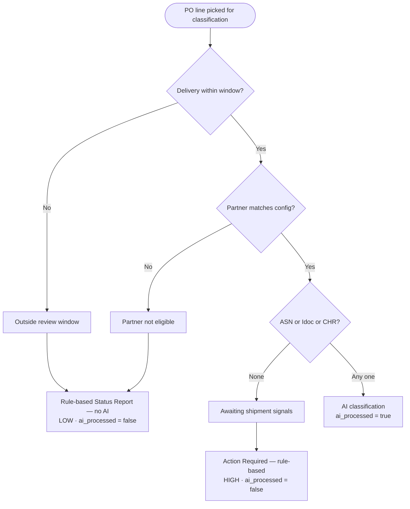

# S/4HANA → ict-backend Sync Endpoints

Reference for the **scheduled sync service** that pulls master + transactional data from
on-premise S/4HANA (via the `mb-api-gateway` app on BTP) and upserts it into the
`ict-backend` tables.

Two destinations are involved — don't confuse them:

- **`MB_API_GATEWAY`** — subaccount destination `ict-backend` uses to reach the gateway.
  Holds the gateway URL (`https://mb-api-gateway.cfapps.us10.hana.ondemand.com`) and its
  OAuth2 client credentials. Resolved by the Cloud SDK; see `srv/lib/s4h/gateway.js`.
- **`S4HANA`** — destination the *gateway* uses to reach on-prem S/4
  (`ProxyType=OnPremise`, via Cloud Connector). Appears in the request path as
  `/proxy/S4HANA`. Never resolved by `ict-backend`.

- **Auth**: OAuth2 `client_credentials` against XSUAA (`mb-api-gateway-xsuaa`, xsappname
  `mb-api-gateway-access`), Bearer token on every call — issued by the destination service.
- **Sync strategy**: **Reconcile (Approach A)** — each run, the set fetched from S/4 is authoritative
  for its scope; local rows in that scope no longer present in S/4 are **closed or deleted**. The
  open set is modest (hundreds–low thousands), so a full re-fetch per run is cheap. **Delta** filters
  (`LastChangeDateTime`) are optional and used only to trim payload once volumes grow.
- **PO scope**: **open items only** — driven from `A_PurchaseOrderItem` filtered on
  `IsCompletelyDelivered eq false`.

> **Implementation plan** (schema changes, code skeletons, reconcile helper, scheduling):
> [S4HANA_POSTGRES_SYNC_GUIDE.md](./S4HANA_POSTGRES_SYNC_GUIDE.md). This file is the endpoint/field reference.

---

## 1. How the proxy URL is built

The proxy takes the **entire OData request as the value of the `path` query parameter**:

```
https://mb-api-gateway.cfapps.us10.hana.ondemand.com/proxy/S4HANA?path=<ODATA_REQUEST>
```

where `<ODATA_REQUEST>` = `/sap/opu/odata/sap/<SERVICE>/<EntitySet>?<$system-query-options>`

**Rules (learned from the working call):**
- Everything after `path=` is passed through to S/4HANA verbatim — including `$expand`, `$filter`, `$top`, etc.
- The **first** option separator is `?`, subsequent options use `&` (standard OData). The proxy re-assembles them correctly.
- Nested `$expand` navigation (e.g. `to_PurchaseOrderItem/to_ScheduleLine`) must keep its literal `/` — so keep the whole OData string inside `path`.
- **In code (the sync job): URL-encode the entire `path` value once.** Manual Postman testing works unencoded.
- The proxy already sends `Accept: application/json`; adding `&$format=json` is belt-and-suspenders.

**Proven working call:**
```
https://mb-api-gateway.cfapps.us10.hana.ondemand.com/proxy/S4HANA?path=/sap/opu/odata/sap/API_PURCHASEORDER_PROCESS_SRV/A_PurchaseOrder?$expand=to_PurchaseOrderItem/to_ScheduleLine
```

> ⚠️ **Verify field names against `$metadata` before finalizing the job.** The field mappings
> below are the standard S/4 names, but customer systems can differ. Each service lists its
> `$metadata` URL — pull it once and confirm.

---

## 2. Service inventory & target tables

| # | S/4 service | Ver | Driving entity set | Target table | Scope | Reconcile action |
|---|-------------|-----|--------------------|--------------|-------|------------------|
| 1 | API_PURCHASEORDER_PROCESS_SRV | 0001 | **A_PurchaseOrderItem** → to_PurchaseOrder / to_ScheduleLine | `po_lines` | **Open items only** | mark `po_status='CLOSED'` |
| 1b | API_PURCHASEORDER_2 (OData v4) | 0001 | `_PurchaseOrderPartner` per open PO | `po_partners` | Open PO numbers | delete orphaned (scoped) |
| 2 | API_INBOUND_DELIVERY_SRV | 0002 | A_InbDeliveryHeader → Item | `asn_ibd` | ASNs for open POs | delete orphaned (scoped) |
| 3 | API_BUSINESS_PARTNER | 0001 | A_Supplier / A_BusinessPartner | `suppliers` | Full set | delete/deactivate missing |
| 4 | API_PRODUCT_SRV | 0001 | A_Product → Description | `materials` | Full set | delete/deactivate missing |
| 5 | API_PLANT_SRV | 0001 | A_Plant | `plants` | Full set | delete/deactivate missing |

---

## 3. Endpoint 1 — Purchase Orders (OPEN only) → `po_lines`

**Scope: open items only.** Drive from `A_PurchaseOrderItem` (not the header) so the open filter can
be applied at item level, then expand up to the header (`to_PurchaseOrder`) and schedule line
(`to_ScheduleLine`). One item = one `po_lines` row.

**$metadata:**
```
.../proxy/S4HANA?path=/sap/opu/odata/sap/API_PURCHASEORDER_PROCESS_SRV/$metadata
```

**Open extract (primary call for the scheduled job):**
```
.../proxy/S4HANA?path=/sap/opu/odata/sap/API_PURCHASEORDER_PROCESS_SRV/A_PurchaseOrderItem?$expand=to_PurchaseOrder,to_ScheduleLine&$filter=IsCompletelyDelivered eq false and PurchasingDocumentDeletionCode eq ''&$top=500
```
- `IsCompletelyDelivered eq false` → not fully delivered = **open** *(verify name in `$metadata`; some
  systems also want `NoGoodsReceiptIsExpected eq false`)*.
- `PurchasingDocumentDeletionCode eq ''` → excludes deleted/blocked items.

**Optional delta** (add when open volume grows — trims payload to items changed since the last run;
still combined with the open filter):
```
.../&$filter=IsCompletelyDelivered eq false and PurchasingDocumentDeletionCode eq '' and LastChangeDateTime gt datetimeoffset'2026-07-01T00:00:00Z'
```

**Reconcile:** after upserting the fetched open items (`po_status='OPEN'`), sweep local rows where
`po_status='OPEN'` that were **not** in this run and set them to `CLOSED` (close, don't delete —
preserves history and child `asn_ibd`/`chr_events`). See the guide's §5.4 / §6.

**Field mapping** (header fields via `it.to_PurchaseOrder`; `delivery_date` from the earliest open
`it.to_ScheduleLine`):

| `po_lines` column | S/4 field | Source (from the item row) |
|---|---|---|
| po_number | PurchaseOrder | A_PurchaseOrderItem |
| line_item | PurchaseOrderItem | A_PurchaseOrderItem |
| material_id | Material | A_PurchaseOrderItem |
| plant | Plant | A_PurchaseOrderItem |
| po_qty | OrderQuantity | A_PurchaseOrderItem |
| po_uom | PurchaseOrderQuantityUnit | A_PurchaseOrderItem |
| net_price | NetPriceAmount | A_PurchaseOrderItem |
| material_group | MaterialGroup | A_PurchaseOrderItem |
| supplier_id | Supplier | to_PurchaseOrder |
| doc_type | PurchaseOrderType | to_PurchaseOrder |
| currency | DocumentCurrency | to_PurchaseOrder |
| doc_date | PurchaseOrderDate | to_PurchaseOrder |
| created_on | CreationDate | to_PurchaseOrder |
| created_by | CreatedByUser | to_PurchaseOrder |
| company_code | CompanyCode | to_PurchaseOrder |
| purch_group | PurchasingGroup | to_PurchaseOrder |
| delivery_date | ScheduleLineDeliveryDate | to_ScheduleLine |
| ship_date | ZZ1_ShipDate_PDI | A_PurchaseOrderItem |
| open_qty | `po_qty - gr_qty` (computed on sync) | job logic |
| received_qty_so_far | sum of ASN `actual_delivery_qty` for the PO line | `asn_ibd` |
| gr_qty | sum of ASN `actual_delivery_qty` where `goods_movement_status = 'C'` | `asn_ibd` |
| po_status | `'OPEN'` (set on upsert; reconcile flips to `CLOSED`) | job logic |
| is_intracompany_transfer | *derived* from doc_type | computed |
| ai_processed | set `false` **only when the line actually changed** | job logic |

> **Received quantity** comes from `asn_ibd.actual_delivery_qty` for the matching PO line.
> **`gr_qty`** counts only ASN rows with `goods_movement_status = 'C'`.
> **`open_qty`** is always `po_qty - gr_qty` on sync. S/4 `OpenPurchaseOrderQuantity` is used only
> to infer `received_qty_so_far` when no ASN rows exist yet.
> **`ai_processed`:** reset to `false` only on real changes (compare `LastChangeDateTime` or a hash),
> otherwise every run re-triggers AI analysis on unchanged lines.

---

## 3b. PO partners (scoped to open POs) → `po_partners`

**Scope:** one S/4 call per **distinct open PO number** from `po_lines`. Synced to `po_partners`;
`ict.config` `partnerFunction` (e.g. `["FS"]`) and `partnerSupplier` (e.g. `["1000122"]`) are checked
together on `ict.po_partners` during classification — a row must match both lists when configured
(`partner_function IN (...) AND supplier IN (...)`). Otherwise a rule-based Status Report note is used.

`ict.config` `aiDeliveryWindow` (e.g. `{"defaultDays":7}`) is applied per line during
classification: far-future deliveries get a rule-based note (no LLM call);
overdue and near-term lines proceed to ASN/Idoc/CHR checks and then AI when eligible.
When **no** ASN, IDoc, or CHR exists, the line is routed to **Action Required** with **HIGH**
priority (missing shipment signals need planner follow-up). Other rule-based blocks (outside
delivery window, ineligible partner) use **Status Report**. Rule-based lines keep
`ai_processed=false` until the LLM actually classifies them.

### PO line classification flow



**OData v4 (per PO):**
```
.../proxy/S4HANA?path=/sap/opu/odata4/sap/api_purchaseorder_2/srvd_a2x/sap/purchaseorder/0001/PurchaseOrder('4500007183')/_PurchaseOrderPartner
```

**Reconcile:** delete `po_partners` rows whose `po_number` is in the open-PO set but were not touched
this run (same pattern as `asn_ibd`).

| `po_partners` column | S/4 field |
|---|---|
| po_number | PurchaseOrder |
| partner_function | PartnerFunction |
| partner_counter | PartnerCounter |
| supplier_subrange | SupplierSubrange |
| plant | Plant |
| purchasing_org | PurchasingOrganization |
| created_by | CreatedByUser |
| created_on | CreationDate |
| purchasing_doc_partner_type | PurchasingDocumentPartnerType |
| supplier | Supplier |
| supplier_hierarchy_category | SupplierHierarchyCategory |
| supplier_contact | SupplierContact |
| person_work_agreement | PersonWorkAgreement |
| employment_internal_id | EmploymentInternalID |
| default_partner | DefaultPartner |

**Sync order:** `po_lines` → **`po_partners`** → `asn_ibd` → `idoc_errors`.

---

## 4. Endpoint 2 — Inbound Deliveries (ASN, scoped to open POs) → `asn_ibd`

**Scope: only ASNs that reference our open PO lines** — not the whole delivery table. The PO link lives
on the **item** (`ReferenceSDDocument` = PO number, `ReferenceSDDocumentItem` = PO item), and this is
an **OData V2** service (no `any()`/`all()` lambda), so **drive from `A_InbDeliveryItem`** and filter
on `ReferenceSDDocument`, then expand **up** to the header via `to_DeliveryDocument`.

> ⚠️ **Verify in `$metadata`:** the item→header nav name (expected `to_DeliveryDocument`; header→item
> is `to_DeliveryDocumentItem`), and that `ReferenceSDDocument`/`ReferenceSDDocumentItem` carry the PO
> (some systems populate `PurchaseOrder`/`PurchaseOrderItem` on the IBD item instead — check both).

**$metadata:**
```
.../proxy/S4HANA?path=/sap/opu/odata/sap/API_INBOUND_DELIVERY_SRV/$metadata
```

**Pattern A — filter by our open PO numbers (primary; precise, minimal payload).**
Take the distinct open PO numbers from `po_lines`, **batch ~40 per request** (the OR-list gets ~3×
longer once URL-encoded inside `path=`), and OR them:
```
.../proxy/S4HANA?path=/sap/opu/odata/sap/API_INBOUND_DELIVERY_SRV/A_InbDeliveryItem?$expand=to_DeliveryDocument&$filter=(ReferenceSDDocument eq '4500000123' or ReferenceSDDocument eq '4500000124' or …)&$format=json
```

**Pattern B — date-bounded fetch + local filter (fallback when there are many open POs).**
One header-driven paged stream, then keep only items whose `ReferenceSDDocument` is in the open-PO set:
```
.../proxy/S4HANA?path=/sap/opu/odata/sap/API_INBOUND_DELIVERY_SRV/A_InbDeliveryHeader?$expand=to_DeliveryDocumentItem&$filter=LastChangeDateTime gt datetimeoffset'2026-06-23T00:00:00Z'
```
Trade-off: Pattern A pulls exactly the relevant rows in `ceil(openPOs/40)` calls; Pattern B is one
stream but over-fetches and filters in JS. For a modest open set, prefer **Pattern A**.

**Reconcile:** upsert the fetched items, then sweep `asn_ibd` rows **whose `reference_document` is in
the current open-PO set** and were untouched this run → delete. Do **not** sweep the whole table
(deliveries outside the open-PO scope must stay). See the guide's §5.5.

**Field mapping** (driving from the item; one `asn_ibd` row per delivery item; header fields via
`item.to_DeliveryDocument`):

| `asn_ibd` column | S/4 field | Source (from the item row) |
|---|---|---|
| delivery | DeliveryDocument | A_InbDeliveryItem |
| item | DeliveryDocumentItem | A_InbDeliveryItem |
| item_category | DeliveryDocumentItemCategory | A_InbDeliveryItem |
| material | Material | A_InbDeliveryItem |
| plant | Plant | A_InbDeliveryItem |
| storage_location | StorageLocation | A_InbDeliveryItem |
| delivery_quantity | OriginalDeliveryQuantity | A_InbDeliveryItem (fallback: DeliveryQuantity) |
| base_unit_of_measure | BaseUnit | A_InbDeliveryItem (fallback: DeliveryQuantityUnit) |
| actual_delivery_qty | ActualDeliveryQuantity | A_InbDeliveryItem |
| item_description | DeliveryDocumentItemText | A_InbDeliveryItem |
| reference_document | ReferenceSDDocument | A_InbDeliveryItem |
| reference_item | ReferenceSDDocumentItem | A_InbDeliveryItem |
| movement_type | GoodsMovementType | A_InbDeliveryItem |
| material_group | MaterialGroup | A_InbDeliveryItem |
| goods_movement_status | GoodsMovementStatus | A_InbDeliveryItem |
| created_by | CreatedByUser | to_DeliveryDocument |
| time | CreationTime | to_DeliveryDocument |
| created_on | CreationDate | to_DeliveryDocument |
| overall_status | OverallSDProcessStatus | to_DeliveryDocument (fallback: OverallGoodsMovementStatus) |
| shipping_point_receiving_pt | ReceivingPlant | to_DeliveryDocument |
| delivery_type | DeliveryDocumentType | to_DeliveryDocument |
| delivery_date | DeliveryDate | to_DeliveryDocument |
| document_date | DocumentDate | to_DeliveryDocument |
| act_goods_movement_date | ActualGoodsMovementDate | to_DeliveryDocument |
| bill_of_lading | BillOfLading | to_DeliveryDocument |
| incoterms | IncotermsClassification | to_DeliveryDocument |
| supplier | Supplier | to_DeliveryDocument |
| external_delivery_id | DeliveryDocumentBySupplier | to_DeliveryDocument (fallback: ExternalDeliveryID) |
| delivery_item | DeliveryDocumentItem | A_InbDeliveryItem (same as item) |

---

## 5. Endpoint 3 — Business Partner / Suppliers → `suppliers`

Two-call pattern is the most reliable (drive from `A_Supplier` to get **only** suppliers, then enrich address from `A_BusinessPartner`).

**$metadata:**
```
.../proxy/S4HANA?path=/sap/opu/odata/sap/API_BUSINESS_PARTNER/$metadata
```

**Call A — supplier + company data:**
```
.../proxy/S4HANA?path=/sap/opu/odata/sap/API_BUSINESS_PARTNER/A_Supplier?$expand=to_SupplierCompany,to_SupplierPurchasingOrg&$top=500
```

**Call B — name + address + email/phone:**
```
.../proxy/S4HANA?path=/sap/opu/odata/sap/API_BUSINESS_PARTNER/A_BusinessPartner?$expand=to_BusinessPartnerAddress/to_EmailAddress,to_BusinessPartnerAddress/to_PhoneNumber&$filter=BusinessPartnerCategory eq '2'&$top=500
```

*(Alternative single call, BP-centric — heavier but one round trip):*
```
.../proxy/S4HANA?path=/sap/opu/odata/sap/API_BUSINESS_PARTNER/A_BusinessPartner?$expand=to_BusinessPartnerAddress/to_EmailAddress,to_BusinessPartnerAddress/to_PhoneNumber,to_Supplier/to_SupplierCompany,to_Supplier/to_SupplierPurchasingOrg&$filter=BusinessPartnerCategory eq '2'
```

**Field mapping** (join Call A + Call B on `Supplier` = `BusinessPartner`):

| `suppliers` column | S/4 field | Entity |
|---|---|---|
| supplier | Supplier / BusinessPartner | A_Supplier |
| name | OrganizationBPName1 | A_BusinessPartner (fallback: A_Supplier.SupplierName, SupplierFullName) |
| name_2 | OrganizationBPName2 | A_BusinessPartner |
| country_region_key | Country | A_BusinessPartnerAddress |
| city | CityName | A_BusinessPartnerAddress |
| postal_code | PostalCode | A_BusinessPartnerAddress |
| region | Region | A_BusinessPartnerAddress |
| street | StreetName | A_BusinessPartnerAddress |
| company_code | CompanyCode | A_SupplierCompany |
| payment_methods | PaymentMethodsList | A_SupplierCompany |
| terms_of_payment | PaymentTerms | A_SupplierCompany |
| clerk_internet_address | EmailAddress | A_AddressEmailAddress |
| created_on | *Excel serial int — derive from* CreationDate | A_BusinessPartner |

> Master data is small — a **full reload** each run is usually fine (no delta needed).

---

## 6. Endpoint 4 — Products / Materials → `materials`

**$metadata:**
```
.../proxy/S4HANA?path=/sap/opu/odata/sap/API_PRODUCT_SRV/$metadata
```

**Full extract (product → description + plant):**
```
.../proxy/S4HANA?path=/sap/opu/odata/sap/API_PRODUCT_SRV/A_Product?$expand=to_Description&$top=500
```

**Filter descriptions to English** (post-fetch, or `$filter` on the expand if the service supports it):
`to_Description` → keep row where `Language eq 'EN'`.

**Field mapping:**

| `materials` column | S/4 field | Entity |
|---|---|---|
| material | Product | A_Product |
| created_on | CreationDate | A_Product |
| material_type | ProductType | A_Product |
| material_group | ProductGroup | A_Product |
| base_unit_of_measure | BaseUnit | A_Product |
| size_dimensions | SizeOrDimensionText | A_Product |
| ean_upc | ProductStandardID | A_Product |
| ean_category | ProductStandardIDCategory *(verify)* | A_Product |
| product_hierarchy | ProductHierarchy | A_Product |
| ext_material_group | ExternalProductGroup *(verify)* | A_Product |
| gen_item_category_group | ItemCategoryGroup *(verify)* | A_Product |
| material_description | ProductDescription (Language='EN') | A_ProductDescription |

---

## 7. Endpoint 5 — Plants → `plants`

**$metadata:**
```
.../proxy/S4HANA?path=/sap/opu/odata/sap/API_PLANT_SRV/$metadata
```

**Full extract:**
```
.../proxy/S4HANA?path=/sap/opu/odata/sap/API_PLANT_SRV/A_Plant?$top=500
```

**Field mapping** (confirm address field names in `$metadata` — plant APIs vary):

| `plants` column | S/4 field | Entity |
|---|---|---|
| plant_code | Plant | A_Plant |
| plant_name | PlantName | A_Plant |
| street_and_house_number | StreetName / StreetAddressName *(verify)* | A_Plant |
| post_code | PostalCode | A_Plant |
| city | CityName | A_Plant |
| country_region_key | Country | A_Plant |
| region | Region | A_Plant |
| purchasing_org | *config-derived / verify* | A_Plant |
| sales_org_icb | *config-derived / verify* | A_Plant |

---

## 8. Operational notes for the scheduled job

**Reconcile (Approach A) — the core loop.** Because the open set is modest (hundreds–low thousands),
each run re-fetches the full authoritative set for the table's scope and makes the table match it:
1. `runTs = now()`; fetch the scoped set from S/4.
2. `UPSERT` all fetched rows (stamp each with `last_synced_at = runTs`).
3. **Sweep** the same scope: rows with `last_synced_at < runTs` (untouched this run) →
   **CLOSE** (`po_lines`) or **DELETE/deactivate** (master data, scoped ASN).

The recommended way to implement the sweep efficiently is a `last_synced_at` watermark column
(see guide §2) rather than a large `NOT IN` key diff.

Per-table scope & reconcile action:

| Table | Scope fetched | Sweep action |
|---|---|---|
| `po_lines` | open items (`IsCompletelyDelivered eq false`) | set `po_status='CLOSED'` where `po_status='OPEN'` and untouched |
| `asn_ibd` | ASNs referencing currently-open POs | delete untouched **within that reference scope** only |
| `suppliers` / `materials` / `plants` | full set | delete, or soft-`is_active=false` (preferred — they're FK targets) |

**Pagination** — S/4 pages server-side (default ~1000 rows). Two options:
- Follow `d.__next` (or `@odata.nextLink`) from each response until absent, **or**
- Page manually with `&$top=500&$skip=<n>` incrementing `n`.

Add `&$inlinecount=allpages` (v2) / `&$count=true` (v4) to get the total up front.

**Delta / incremental load (optional — not required for correctness under reconcile):**
- With reconcile + a modest open set, a **full re-fetch each run is the default**. Delta is a payload
  optimization to add **later** if runs get heavy.
- **PO** and **Inbound Delivery** support `LastChangeDateTime` → filter `gt` the last successful run.
  ⚠️ **Caveat:** a pure delta breaks the reconcile sweep (closed/removed items won't appear in the
  delta, so they'd never get swept). If you adopt delta, either (a) keep a periodic **full**
  reconcile pass, or (b) also pull items whose status flipped so the sweep can act. Store a
  high-water mark per table.
- **Suppliers / Materials / Plants** — small; full reload + reconcile each run.

**Auth in the job:**
1. `POST {xsuaa.url}/oauth/token` with `grant_type=client_credentials` (Basic auth = clientid:clientsecret). **Do not send a `scope` param.**
2. Cache the token until ~60s before `expires_in`, then refresh.
3. Send `Authorization: Bearer <token>` on every proxy call.

**Upsert strategy:** key columns per table —
`po_lines` (po_number, line_item) · `asn_ibd` (delivery, item) · `suppliers` (supplier) ·
`materials` (material) · `plants` (plant_code). Use `UPSERT`/merge on those keys.

**Suggested cadence:** transactional (open PO, ASN) every 15–30 min (full re-fetch + reconcile of the
open set); master data (suppliers, materials, plants) nightly (full reload + reconcile).

**Error handling:** the proxy returns `401` (token expired → refresh & retry once), `403`
(missing scope → check XSUAA), `404` (wrong path/service not activated), `503` (SAP/Cloud
Connector down → retry with backoff). Bodies are JSON with an `error` field.
