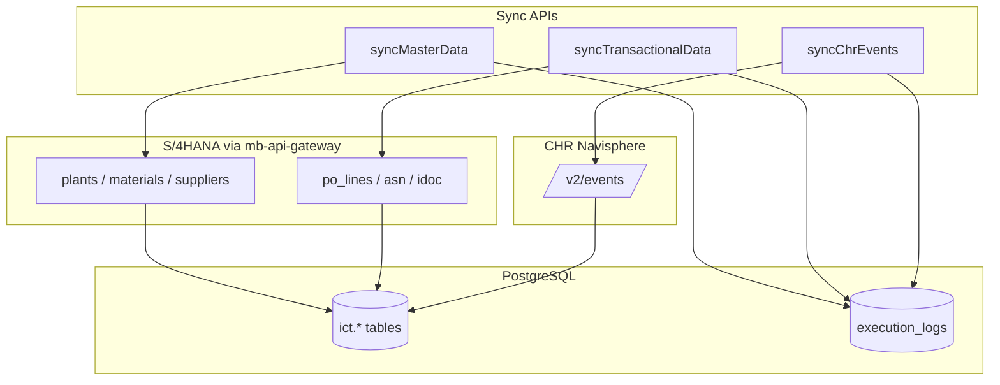

# ICT Sync API

Three background sync jobs pull data from S/4HANA (via `mb-api-gateway`) and CHR Navisphere into PostgreSQL. Each job returns **immediately** with a `runId`; work continues in the background.

**Base URL (local):** `http://localhost:4000/odata/v4/catalog`

**Swagger:** `http://localhost:4000/swagger-ui`

---

## Overview

| API | Job name | Source | Target tables | Typical schedule |
|-----|----------|--------|---------------|------------------|
| `syncMasterData` | `S4_MASTER_SYNC_JOB` | S/4HANA OData | `plants`, `materials`, `suppliers` | Monthly / quarterly |
| `syncTransactionalData` | `S4_TRANSACTIONAL_SYNC_JOB` | S/4HANA OData | `po_lines`, `asn_ibd`, `idoc_errors` | Hourly / daily |
| `syncChrEvents` | `S4_CHR_SYNC_JOB` | CHR `/v2/events` | `chr_events` | Every 15–30 min |

Pipelines are **independent** — each has its own concurrency lock. Master, transactional, and CHR can run in parallel, but only **one run per pipeline** at a time.

---

## Common behaviour

### Request

All actions use **POST** with `Content-Type: application/json`.

### Accepted response

```json
{
  "status": "Accepted",
  "runId": "uuid",
  "job": "S4_MASTER_SYNC_JOB",
  "message": "Syncing …",
  "meta": { }
}
```

### Progress & result

Poll execution logs:

```http
GET /odata/v4/catalog/ExecutionLogs('<runId>')
```

Or list recent runs:

```http
GET /odata/v4/catalog/ExecutionLogs?$orderby=started_at desc&$top=10
```

Log `status`: `RUNNING` → `SUCCESS` or `FAILURE`. Details are in `log_entries`.

### HTTP errors (before job starts)

| Code | Meaning |
|------|---------|
| `400` | Invalid body (bad dates, missing `customer`, etc.) |
| `409` | Same pipeline already running — use existing `runId` |

### Under the hood (all jobs)

1. Handler validates input and checks concurrency lock.
2. `cds.spawn` starts a **background** job (HTTP thread is not blocked).
3. `LogCollector` writes to `ict.execution_logs` (progress every ~800ms).
4. On completion, lock is released in `finally` (even on failure).

**S/4 calls:** OAuth token → `mb-api-gateway` → on-prem S/4 OData. Paged fetch, batch upsert, retries on 429/5xx, 60s timeout.

**Local dev:** `NODE_ENV !== 'production'` caps each entity at **500 rows** (`LIMITED(500)`), regardless of `S4H_SYNC_LIMIT=ALL`.

---

## 1. `syncMasterData`

Master / reference data — slow-changing, full refresh with reconcile.

### Request

```http
POST /odata/v4/catalog/syncMasterData
Content-Type: application/json

{}
```

No body parameters.

### Entity order

```
plants → materials → suppliers
```

### Under the hood

```
For each entity:
  OData pages ($top / $skip or __next)
    → map S/4 fields to DB columns
    → upsert batch into PostgreSQL
  Reconcile (production full sync only):
    → deactivate rows not seen in this run
```

| Step | Detail |
|------|--------|
| Fetch | `fetchInPages()` — one page at a time, no long DB hold during HTTP |
| Write | `upsertInBatches()` — default 200 rows per transaction |
| Reconcile | Soft-deactivate stale master rows when `reconcileEnabled` (prod full sync) |

### When to run

After org changes, new plants/materials/suppliers, or on a **monthly** BTP Job Scheduler cadence.

---

## 2. `syncTransactionalData`

Operational data — PO lines, inbound deliveries (ASN/IBD), IDoc errors.

### Request

```http
POST /odata/v4/catalog/syncTransactionalData
Content-Type: application/json

{
  "fromDate": "2026-01-01",
  "toDate": "2026-07-27"
}
```

| Parameter | Required | Default | Applies to |
|-----------|----------|---------|------------|
| `fromDate` | No* | 30 days ago | `po_lines` OData filter only |
| `toDate` | No* | Today | `po_lines` OData filter only |

\* If either date is sent, **both** are required (`YYYY-MM-DD`).

### Entity order

```
po_lines → asn_ibd → idoc_errors
```

### Under the hood

**`po_lines`**

- S/4: `A_PurchaseOrderItem` with date filter on `PurchaseOrderDate`.
- Open items synced; reconcile closes local `OPEN` rows missing from S/4.
- Line items normalized to 5-digit SAP form (`10` → `00010`) for ASN association.

**`asn_ibd`**

- Scope: **open PO numbers** from `po_lines` where `po_status = 'OPEN'`.
- Fetches IBD items per PO batch, enriches headers, upserts `asn_ibd`.
- Reconcile deletes orphaned ASNs in open-PO scope.

**`idoc_errors`**

- Scope: same open PO numbers.
- Streams DESADV IDoc errors from S/4, upserts `edi856_idoc_errors`.

```
po_lines (date range from API)
    ↓ writes open POs to DB
asn_ibd + idoc_errors (read open PO list from DB)
```

### When to run

**Hourly or daily** on BTP Job Scheduler. Run **after** master data when new suppliers/materials were added.

---

## 3. `syncChrEvents`

CHR Navisphere logistics events — separate source, event-time window.

### Request

```http
POST /odata/v4/catalog/syncChrEvents
Content-Type: application/json

{
  "lookbackMinutes": 90,
  "customer": "C7189686"
}
```

| Parameter | Required | Default | Notes |
|-----------|----------|---------|-------|
| `customer` | **Yes** | — | Client-side filter on `row.customer` after fetch |
| `lookbackMinutes` | No | `90` (or `CHR_EVENTS_LOOKBACK_MINUTES` env) | Rolling `eventTime` window |

### Under the hood

CHR’s `/v2/events` API **cannot** filter by `customer` or `eventTime` server-side (query params are rejected). The sync therefore:

```
1. GET /proxy/CHR?path=/v2/events     (single bulk call)
2. Filter in code:
     - customer match
     - eventTime >= now - lookbackMinutes  (no upper cap — CHR clock skew)
3. Map each event × item → chr_events row
4. Set po_linked = true if po_number is in open po_lines (OPEN)
5. Dedupe by source_hash (CHR sends near-duplicate pairs)
6. Upsert into PostgreSQL
```

**Important CHR limits**

| Field | Meaning |
|-------|---------|
| `sourceTotal` | Total events in CHR (~68k) — **not** upserted count |
| `sourceReturned` | Rows in API page (max ~500, no paging) |
| `matchedInSource` | Events after customer + time filter |
| `upserted` | Rows actually written to DB |

Set `lookbackMinutes` ≥ your job interval (e.g. job every 30 min → use 45–90 min).

**`po_linked`**

- `true` — CHR `po_number` matches an **open** PO in `po_lines`
- `false` — otherwise (event is still stored)
- CHR sync does **not** require PO sync first; flag is informational

### When to run

Every **15–30 minutes**, independent of S/4 transactional sync.

---

## Recommended scheduler setup (BTP)

| Job | API | Cron example |
|-----|-----|--------------|
| Master | `syncMasterData` | `0 2 1 * *` (1st of month, 02:00) |
| Transactional | `syncTransactionalData` | `0 */1 * * *` (hourly) |
| CHR | `syncChrEvents` | `*/15 * * * *` (every 15 min) |

First-time / recovery order:

1. `syncMasterData`
2. `syncTransactionalData`
3. `syncChrEvents` (repeat on schedule)

---

## Environment variables

### API gateway (required for master + transactional)

**On BTP** nothing is configured here. The gateway URL and its OAuth2 client credentials
live in the `MB_API_GATEWAY` subaccount destination, resolved via the bound destination
service. Override the destination name with `API_GATEWAY_DESTINATION` if needed.

**Locally** the destination service is not bound, so `srv/lib/s4h/gateway.js` falls back to:

| Variable | Purpose |
|----------|---------|
| `S4H_PROXY_URL` | Gateway base URL |
| `S4H_XSUAA_URL` | OAuth token URL |
| `S4H_XSUAA_CLIENTID` | Gateway client ID |
| `S4H_XSUAA_CLIENTSECRET` | Gateway client secret |

### Tuning (optional)

| Variable | Default | Purpose |
|----------|---------|---------|
| `S4H_PAGE_SIZE` | `50` | OData page size |
| `S4H_UPSERT_BATCH_SIZE` | `200` | DB upsert batch |
| `S4H_PROXY_TIMEOUT_MS` | `60000` | HTTP timeout |
| `S4H_PROXY_RETRIES` | `3` | Retry count |
| `S4H_SYNC_LIMIT` | — | Prod row cap (ignored in local dev) |
| `S4H_RECONCILE` | `true` in prod full sync | Master/PO reconcile |
| `CHR_EVENTS_PATH` | `/v2/events` | CHR API path |
| `CHR_EVENTS_LOOKBACK_MINUTES` | `90` | Default when body omits lookback |

---

## Architecture



---

## Code map

| Area | Path |
|------|------|
| OData actions | `srv/cat-service.cds` |
| HTTP handlers | `srv/handlers/sync-handler.js` |
| S/4 entity order | `srv/lib/s4h/sync-registry.js` |
| CHR sync | `srv/lib/s4h/chr-events-syncer.js` |
| CHR config / filters | `srv/lib/s4h/entities/chr-events.js` |
| PO date scope | `srv/lib/s4h/sync-scope.js` |
| Proxy / paging | `srv/lib/s4h/fetch.js` |
| Runtime config | `srv/lib/s4h/config.js` |

---

## BTP Job Scheduler

Sync pipelines use the same `JobSchedules` entity and BTP Job Scheduler integration as AI analysis. Create schedules in the **Admin → Schedule** tab or via OData on `JobSchedules`.

### Job types

| `job_type` | BTP callback | Manual action |
|------------|--------------|---------------|
| `S4_MASTER_SYNC` | `POST /odata/v4/catalog/runScheduledSync` | `syncMasterData` |
| `S4_TRANSACTIONAL_SYNC` | `POST /odata/v4/catalog/runScheduledSync` | `syncTransactionalData` |
| `S4_CHR_SYNC` | `POST /odata/v4/catalog/runScheduledSync` | `syncChrEvents` |

BTP sends `x-sap-job-id`, `x-sap-job-schedule-id`, and `x-sap-job-run-id` headers. The handler resolves the matching `JobSchedules` row, reads `job_type` + `config`, and starts the correct pipeline in the background (same pattern as `analyzeExceptions`).

### Schedule patterns

Each job has exactly one BTP schedule mode. Set `schedule_pattern` + `schedule_value` on create (or legacy `cron_expression` for `CRON` only — it is copied into `schedule_value` automatically).

| `schedule_pattern` | `schedule_value` example | BTP field |
|--------------------|--------------------------|-----------|
| `REPEAT_INTERVAL` | `30 minutes`, `1 hours`, `1 days` | `repeatInterval` |
| `CRON` | `* * * * * */30 0` (xscron) | `cron` |
| `REPEAT_AT` | `6:30am` | `repeatAt` |
| `ONE_TIME` | ISO timestamp | `time` |

`schedule_pattern` cannot be changed after creation — delete and recreate the schedule to switch modes.

### Suggested defaults (repeat interval)

| Pipeline | Pattern | Value | Notes |
|----------|---------|-------|-------|
| Master | `REPEAT_INTERVAL` | `1 days` | Daily full refresh |
| Transactional | `REPEAT_INTERVAL` | `1 hours` | Hourly PO window |
| CHR | `REPEAT_INTERVAL` | `30 minutes` | Frequent event pull |

Cron equivalents (BTP xscron) if you prefer `CRON`:

| Pipeline | Example cron | Notes |
|----------|--------------|-------|
| Master | `* * * * * */1440 0` | Daily |
| Transactional | `* * * * * */60 0` | Hourly |
| CHR | `* * * * * */30 0` | Every 30 min |

### `config` JSON per type

**`S4_MASTER_SYNC`** — empty object `{}`

**`S4_TRANSACTIONAL_SYNC`**

```json
{ "lookbackDays": 30 }
```

Rolling PO window (default 30 days if omitted). Optional fixed range: `{ "fromDate": "2026-01-01", "toDate": "2026-07-27" }` (do not combine with `lookbackDays`).

**`S4_CHR_SYNC`**

```json
{ "customer": "C7189686", "lookbackMinutes": 90 }
```

`customer` is required. `lookbackMinutes` defaults to `CHR_EVENTS_LOOKBACK_MINUTES` or 90.

### Example: create a CHR schedule (OData)

```http
POST /odata/v4/catalog/JobSchedules
Content-Type: application/json

{
  "job_name": "CHR events — C7189686",
  "job_type": "S4_CHR_SYNC",
  "schedule_pattern": "REPEAT_INTERVAL",
  "schedule_value": "30 minutes",
  "batch_size": 1,
  "is_active": true,
  "config": "{\"customer\":\"C7189686\",\"lookbackMinutes\":90}"
}
```

On create/update/delete, the backend registers the job with BTP Job Scheduler (mock mode locally). Runs appear in `BTPExecutionLogs` and `ExecutionLogs` like AI jobs.

If a pipeline is already running, the scheduled invocation logs a skip (does not fail the BTP job with HTTP 409).

---

## Quick test (curl)

```bash
# Master
curl -s -X POST "http://localhost:4000/odata/v4/catalog/syncMasterData" \
  -H "Content-Type: application/json" -d '{}' | jq .

# Transactional
curl -s -X POST "http://localhost:4000/odata/v4/catalog/syncTransactionalData" \
  -H "Content-Type: application/json" \
  -d '{"fromDate":"2026-01-01","toDate":"2026-07-27"}' | jq .

# CHR
curl -s -X POST "http://localhost:4000/odata/v4/catalog/syncChrEvents" \
  -H "Content-Type: application/json" \
  -d '{"lookbackMinutes":90,"customer":"C7189686"}' | jq .
```

Replace `runId` from the response:

```bash
curl -s "http://localhost:4000/odata/v4/catalog/ExecutionLogs('<runId>')" | jq .
```
